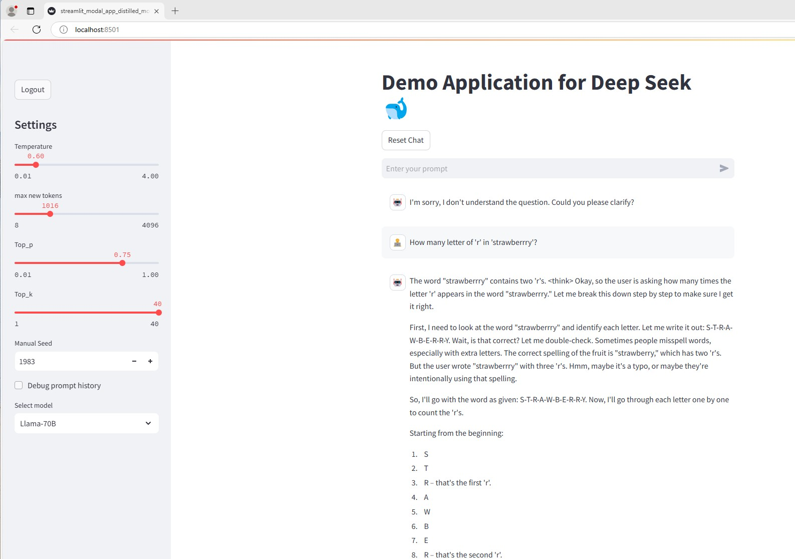

Chat UI with Deep Seek Distilled models hosted on Modal server

[](Videos/DemoDeepSeekDistilled.mp4)

# DeepSeekr1 Modal Setup and Usage Guide

## Prerequisites
**Create an account on Modal**  
   Set up your account and environment by following the instructions [here](https://modal.com/docs/guide).

## Local Execution

### Overview
Each model is contained in a separate Python file. For example, `Deepseekr1_modal_lmdeploy_Llama_8B.py` contains the distilled DeepSeek `Llama_8B` model, and other files follow a similar structure.

### Running Models Locally
To test an individual model, run the following command:
```bash
modal run Deepseekr1_modal_lmdeploy_[MODEL_NAME].py
```

Each file contains a `@app.local_entrypoint` that initializes a message_list.
## Creating an API Endpoint

To create an API endpoint for a model, use the following command:

```bash
 modal serve Deepseekr1_modal_lmdeploy_[MODEL_NAME].py
``` 
Note the url created on the terminal when executing this command which should be put in the `secrets.toml` file in the `url` variable. The url should be same irresepective of the model being started.

The models needs weight that can be easily downloaded using the script `DeepSeek_model_download.py`. The distilled models are stored in a persistent volume mapped to `/models/DeepSeek-model`
Example use to download a model weight `modal run Deepseek_model_download.py::download_model_to_image --hfrepoid deepseek-ai/DeepSeek-R1-Distill-Qwen-32B `
It is possible to connect to a shell by running the command `model shell Deepseek_model_download.py::download_model_to_image` and then navigating using linux commands to monitor the files
In case there is any issue with file downloading it is recommended to use the shell command, start python and use the proper path and `snapshot_download` command to finish the download

The modal files use `lmdeploy` python library to load up the DeepSeek models and this is needed on the cliend side as well.

(Not tested) The original `Deepseek R1` can also be run similarly loaded up using the script `Deepseekr1_modal_lmdeploy_670B.py` after having downloaded the weights using the script `DeepSeek_model_download.py`.
However it takes about 10 `A100-80GB` [source](https://github.com/InternLM/lmdeploy/issues/2960) to load up the model in `fp8` format and sepcial permission from `modal` is needed to have access to that many GPUs. However if on any other platform/server there is same amount of GPU resource available then one can try it out. 

* GUI
It is recommended to test out the local execution of the individual model files before trying out the GUI

The GUI can be started with the command `streamlit run streamlit_modal_app_distilled_models.py`. A `secrets.toml` file as shown in sample needs to be created with credentials for authentication purpose.
If executed locally create a folder `.streamlit` and put the `secrets.toml` there and if deployed on streamlit community cloud then it will need to be entered in the secrets.

After successful authentication the user will be presented with a page to enter a prompt, with some default parameters and make a query and Llama_8b will start automatically. No need to separately run modal scripts. The user request on the first time takes a bit of time to load up the model by `lmdeploy` script but subsequent requests takes less time. Although the `lmdeploy` engine shuts down after a bit of inactivity.

Model switching also takes time and increases proportionally to the number of parameters in the model. Increasing the number of new tokens is recomended if chat is going on too long and generally the models respond with a lot of text indicating the thinking process.


